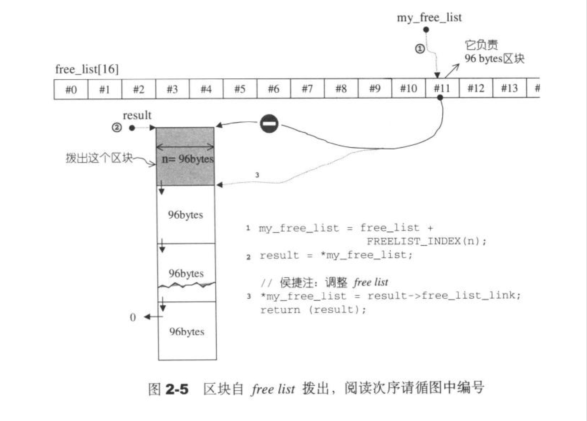
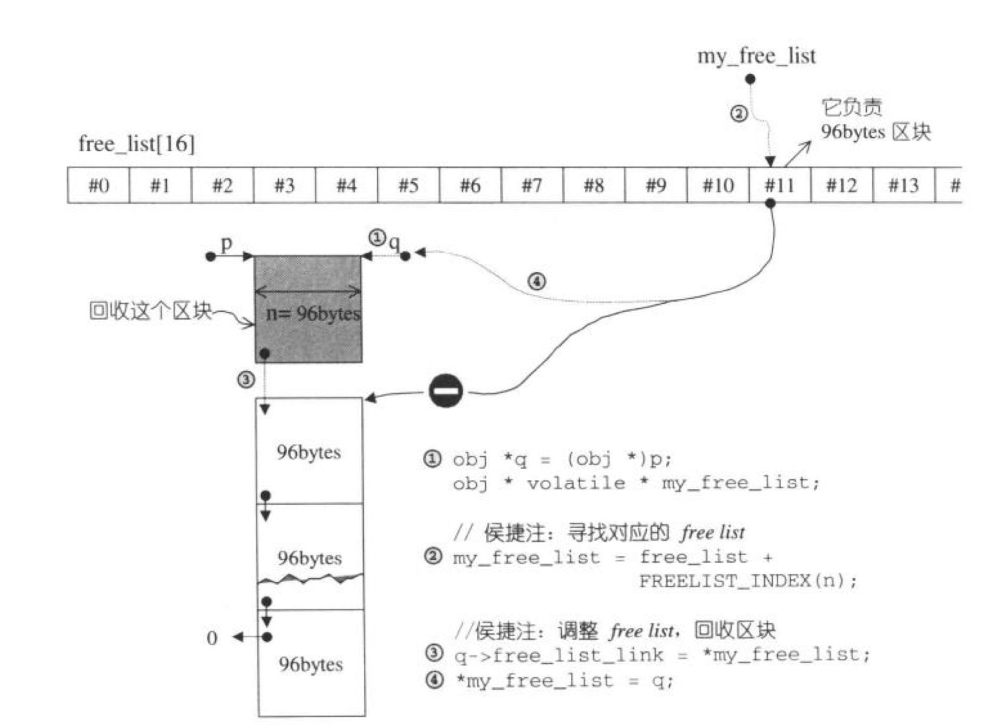

## 问题：

### alloc的第一级内存配置器为什么要用malloc和free

[new、delete与malloc、free的区别，内在实现](https://blog.csdn.net/JACKSONMHLK/article/details/123298801)

- c++的内存基本操作是`operator new()`,内存释放的基本操作是`operator delete()`。相当于c语言的`malloc`和`free`函数。
- 使用`malloc`和`free`函数作为STL第一级内存配置器的原因是它们是标准C库中的函数，因此在不同的平台和编译器上都可以使用。这意味着STL可以在各种不同的操作系统和编译器上运行，并且不需要针对每个平台和编译器进行特定的修改。
- `malloc`和`free`函数已经经过多年的测试和优化，具有很高的稳定性和性能。它们使用了许多底层的系统调用和优化技巧，以确保在各种情况下都能提供快速和可靠的内存分配和释放。
- c++并未提供相应于`realloc()`的内存配置操作


### c++的内存基本操作`operator new()`,内存释放的基本操作是`operator delete()`的底层实现

C++中的`operator new()`和`operator delete()`函数的底层实现可能使用`malloc()`和`free()`函数来实现内存分配和释放操作，但这并不是必须的。

实际上，C++标准并没有规定`operator new()`和`operator delete()`函数的底层实现必须使用`malloc()`和`free()`函数。这些函数的实现可以使用任何适合的内存分配和释放算法，只要它们符合C++标准的规定即可。

然而，许多C++编译器和实现都使用了`malloc()`和`free()`函数来实现`operator new()`和`operator delete()`函数。这是因为`malloc()`和`free()`函数是C标准库中的函数，它们已经被广泛使用和测试，并且在各种操作系统和平台上都可用。

此外，许多现代操作系统和编译器都对`malloc()`和`free()`函数进行了优化，以提高内存分配和释放的性能和效率。因此，使用`malloc()`和`free()`函数来实现`operator new()`和`operator delete()`函数是一种通用、可靠、高效的方法。

需要注意的是，`malloc()`和`free()`函数与`operator new()`和`operator delete()`函数之间并不是等价的。虽然它们都用于内存分配和释放，但它们的行为和使用方式有所不同。在C++中，建议使用`new`和`delete`关键字来进行内存分配和释放，而不是直接调用`malloc()`和`free()`函数。


### 联合体

`union`的是"联合体"（union），它是一种C++中的数据类型，允许在同一内存空间中存储不同类型的数据。`union`的设计初衷是为了**节省内存空间**，同时也可以用于数据类型之间的转换。

在C++标准中，`union`被定义为一种聚合类型（Aggregate Type），也就是说，它可以像结构体一样被看作是一组相关的数据类型。**可以使用点号或箭头运算符来访问 union 成员。点号运算符用于访问结构体的成员，而箭头运算符用于访问指向结构体的指针的成员。**与结构体不同的是，`union`中的各个成员共享同一块内存空间，因此**在同一时间只能访问 union 中的一个成员，因为 union 中的所有成员共享同一块内存。**

尽管`union`的使用场景有限，但它在某些情况下是非常有用的，例如在编写嵌入式系统时，可以使用`union`类型来共享同一块内存空间来存储不同类型的数据，并且可以用于节省内存空间。此外，在网络编程中，`union`类型还可以用于表示不同字节序之间的转换。


```c++
union obj{
	union obj* free_list_link;
	char client_data[1];
};
```

这段代码定义了一个联合体`obj`，它有两个成员变量：

1. `free_list_link`，是一个指向`obj`类型的指针，通常用于将`obj`对象加入到一个空闲链表中，以便进行内存分配。
2. `client_data`，是一个字符数组，用于存储`obj`对象的实际数据。

需要注意的是，`client_data`数组的长度为1，这是因为在C++中，联合体中的所有成员变量都共享同一段内存空间。因此，为了保证`obj`对象的实际数据可以存储任意长度的数据，通常使用一个长度为1的字符数组来作为`client_data`成员变量，并通过指针运算来访问实际的数据。

例如，假设我们需要创建一个`obj`对象，并将一个`int`类型的数据存储在其中，可以采用以下方式：

```c++
int data = 123;
obj* my_obj = (obj*) malloc(sizeof(obj) + sizeof(int) - 1);
*(int*) my_obj->client_data = data;
```

这里，我们首先使用`malloc`函数分配了一个大小为`sizeof(obj) + sizeof(int) - 1`字节的内存空间，其中`sizeof(obj)`表示`obj`对象本身的大小，`sizeof(int) - 1`表示我们需要额外分配的空间，用于存储一个`int`类型的数据。

然后，我们将分配的内存空间强制转换成一个指向`obj`类型的指针`my_obj`，并使用指针运算访问`my_obj->client_data`成员变量，将`data`的值存储在其中。

需要注意的是，使用联合体来存储变长数据通常需要进行指针运算和类型转换，使得代码可读性较低，同时也容易出错。因此，在实际使用中，通常会采用其他方式来存储变长数据，例如使用动态数组或模板类等方式。


### 枚举

`enum`是C++中的一种数据类型，用于定义一组具有离散取值的常量。`enum`可以被用来定义一组相关的常量，这些常量通常都属于同一类别或类型。

以下是一个`enum`的例子：

```c++
enum Color {
    RED,
    GREEN,
    BLUE
};
```

在上面的代码中，我们定义了一个`enum`类型的变量`Color`，它包含了三个常量：`RED`、`GREEN`和`BLUE`。这些常量的值分别是0、1和2（如果没有显式地指定值的话）。可以使用`enum`类型来定义一组相关的常量，这些常量可以用于代表不同的状态、错误码或选项等等。

`enum`类型的变量通常被定义为整型，但是在C++11标准中，我们可以使用`enum class`来定义一组强类型枚举。强类型枚举可以提供更好的类型安全性，避免了`enum`类型的一些缺陷。

以下是一个强类型枚举的例子：

```c++
enum class Color : int {
    RED = 1,
    GREEN = 2,
    BLUE = 3
};
```

在上面的代码中，我们使用了`enum class`来定义了一个强类型枚举类型的变量`Color`，它包含了三个常量：`RED`、`GREEN`和`BLUE`，并且它们的值分别是1、2和3。在使用强类型枚举时，我们必须显式地指定枚举类型的基础类型，以及每个常量的值。

总之，`enum`类型是C++中的一种非常实用的数据类型，它可以用于定义一组相关的常量，并且可以提高程序的可读性和可维护性。在使用`enum`类型时，我们需要注意一些细节，例如可以使用`enum class`来提高类型安全性，以及在定义常量时需要注意使用逗号分隔等等。


### 内存对齐

[参考知乎](https://zhuanlan.zhihu.com/p/30007037)

#### 什么是内存对齐

要求这些数据的手地址的值是某个数k（通常是4或8的倍数）。

#### 为什么进行内存对齐

**提高处理器读取内存的效率**

大部分处理器一般是以双字节、四字节....（内存粒度）为单位来存取内存。

现在考虑4字节存取粒度的处理器取int类型变量（32位系统），该处理器只能从地址为4的倍数的内存开始读取数据。

假如没有内存对齐机制，数据可以任意存放，现在一个int变量存放在从地址1开始的联系四个字节地址中，该处理器去取数据时，要先从0地址开始读取第一个4字节块,剔除不想要的字节（0地址）,然后从地址4开始读取下一个4字节块,同样剔除不要的数据（5，6，7地址）,最后留下的两块数据合并放入寄存器.这需要做很多工作.

现在有了内存对齐的，int类型数据只能存放在按照对齐规则的内存中，比如说0地址开始的内存。那么现在该处理器在取数据时一次性就能将数据读出来了，而且**不需要做额外的操作，提高了效率。**

#### 对齐规则

1.基本类型的对齐值就是其sizeof值;
2.结构体的对齐值是其成员的最大对齐值;
3.编译器可以设置一个最大对齐值，怎么类型的实际对齐值是该类型的对齐值与默认对齐值取最小值得来。


### volatile

在C++中，关键字"volatile"可以用来声明一个易变变量，以告诉编译器该变量的值可能在任何时候发生更改，从而强制编译器在每次访问时重新读取该变量的值。这可以确保在多线程程序中访问该变量时不会发生意外的行为。

此外，"volatile"关键字还可以用于指示编译器不要优化与该变量相关的代码。这是因为编译器通常会根据代码的执行顺序和语义来进行优化，但是如果涉及到易变变量，则这种优化可能会导致错误的行为。

需要注意的是，使用"volatile"关键字并不一定能够完全解决多线程编程中的并发问题，因为它只能确保变量的可见性，而不能保证原子性或有序性。对于需要进行原子操作或有序访问的变量，需要使用其他机制，如互斥锁或原子类型。


### `return(p)`和`return p`

在C++中，`return(p)`和`return p`是等价的，因为括号在这种情况下并不会改变表达式的值或类型。两种语法都表示将`p`作为返回值返回给调用者。

然而，在其他情况下，括号可能会改变表达式的值或类型，因此在选择使用括号或不使用括号时，需要注意上下文的语法和语义。通常情况下，使用括号可以使代码更易于理解和维护，因为它们可以帮助消除二义性并明确表达式的执行顺序。


### memcpy()

`memcpy()`函数用于将一段内存块的数据复制到另一个内存块中，即从源内存地址复制若干个字节到目标内存地址。其函数原型如下：

```c
void *memcpy(void *dest, const void *src, size_t n);
```

其中，`dest`为目标内存块的起始地址，`src`为源内存块的起始地址，`n`为要复制的字节数。函数返回指向目标内存块的指针。

`memcpy()`函数可以处理任意类型的数据，包括基本类型（如int、float等）和自定义类型（如结构体、类等），因为它只是将内存中的一段数据按字节进行复制，不关心数据类型和数据的含义。但需要注意的是，源内存块和目标内存块不能重叠，否则结果将是不确定的。

`memcpy()`函数通常用于以下场景：

- 复制字符串或字符数组
- 复制数组或结构体
- 复制动态分配的内存块
- 将一个变量的值传递给另一个变量
- 实现一些数据结构和算法

需要注意的是，在C++中，推荐使用`std::copy()`或`std::copy_n()`等STL算法代替`memcpy()`函数，因为STL算法更加安全和易用，且支持迭代器等高级特性。


### memmove()

`memmove` 是 C/C++ 中的一个标准库函数，用于将一段内存区域的数据拷贝到另一个内存区域。如果目标区域和源区域有重叠的话，memmove() 能够保证源串在被覆盖之前将重叠区域的字节拷贝到目标区域中，复制后源区域的内容会被更改。如果目标区域与源区域没有重叠，则和 memcpy() 函数功能相同。其函数原型如下：

```c++
void* memmove(void* dest, const void* src, size_t count);
```

其中，`dest` 表示目标内存区域的起始地址，`src` 表示源内存区域的起始地址，`count` 表示要移动的字节数。

`memmove` 函数与 `memcpy` 函数类似，但是 `memmove` 函数可以处理源和目标内存区域重叠的情况，而 `memcpy` 函数不可以。因此，在需要处理重叠内存区域的情况下，应该使用 `memmove` 函数而不是 `memcpy` 函数。

`memmove` 函数通常在 C/C++ 程序中使用，其头文件是 `<cstring>` 或者 `<string.h>`，需要注意的是，在 C++ 中，建议使用 `<cstring>` 头文件中的函数，而不是 `<string.h>` 中的函数，因为 `<string.h>` 是 C 语言中的头文件，可能在 C++ 中不被支持。


### 为什么对char和wchar_t的拷贝进行特化

在 C++ 标准库中，对于 `char*` 和 `wchar_t*` 类型的字符串，提供了一些特化的拷贝函数。这是因为这些字符串类型在内存中的存储方式和普通类型不同，需要特殊的处理方式。

对于 `char*` 类型的字符串，它是以 `\0` 结尾的一段字符数组，也就是所谓的 C 风格字符串。因此，在拷贝 `char*` 字符串时，需要拷贝整个字符串，包括字符串末尾的 `\0` 字符。否则，如果拷贝的数据长度不足，就无法保证目标字符串以 `\0` 结尾，这可能导致后续的字符串操作出现问题。

对于 `wchar_t*` 类型的字符串，它是以双字节编码的一段字符数组，也就是所谓的宽字符字符串。在拷贝 `wchar_t*` 字符串时，同样需要保证目标字符串以 `\0` 结尾，并且需要保证拷贝的字节数是偶数，因为 `wchar_t` 类型的大小通常是 2 个字节。

因此，对于这些特殊的字符串类型，需要提供特化的拷贝函数，以保证拷贝的正确性。在 C++ 标准库中，对于这些字符串类型，提供了 `std::memcpy`、`std::memmove`、`std::strcpy`、`std::strncpy`、`std::wcsncpy` 等函数的特化版本，以便于处理这些字符串类型的拷贝操作。


### c++的内存分配分配的空间是那个硬件设备上的


## 空间配置器运行逻辑：

[原文](https://juejin.cn/post/7089059863602397220)

该配置器设计了双层级别：

- 一级配置器：直接使用malloc、free、以及内存申请失败的处理。
- 二级配置器：将采用复杂的内存池来管理。

### 内存分配过程

当请求的内存大于128bytes时，用第一级配置器调用malloc,free等函数创建和销毁内存。

当请求的内存小于128bytes时，用第二级配置器调用allocate函数分配，过程如下：

- 先把请求的内存补齐成8的倍数n个字节。然后搜索内存链表索引`free_list`。如果不为空，把free_list对应的内存链表返回给用户。如果为空，说明`free_list`没有对应大小的空间了。调用`refill`重新为free_list填充“多个”n字节的内存。（这个的“多个”在`refill`中用变量`nobjs`表示，默认为20个。）`refill`调用`chunk_alloc`函数从内存池分配一个大的内存，大小为`nobjs*n`。如果内存池用剩余的大小不足`nobjs*n`，则有多少分配多少。`chunk_alloc`函数分配完大内存后，`refill`做的工作就是把大内存中除了所请求的内存（放在`my_free_list[0]`）外，把大内存剩余的内存连接到`free_list`对应的索引之下，以便后续使用。


### 1.一级配置器

当请求的内存大于128时，使用该分配器,直接使用malloc,free分配空间；该分配器使用仿照`::operator new`的`new_headler`机制来处理异常。如果分配失败，就调用错误处理函数处理。

```c++
template<int __inst>
class __malloc_alloc_template {
private:
    //用于 在设置了__malloc_alloc_oom_handler 的情况下循环分配内存，直到成功分配
    //这三个都是函数指针，前两个返回void*类型，第三个没有返回值void
    static void *oom_malloc(size_t);

    static void *oom_realloc(void *, size_t);

    static void (*__malloc_alloc_oom_handler)();

    //如果编译器支持模版类静态成员，则使用错误处理函数，类似C++的set_new_handler()
    // 默认值为0，如果不设置，则内存分配失败时直接__THROW_BAD_ALLOC
    /* __malloc_alloc_oom_handler是一个函数指针，用于设置处理内存分配失败的错误处理函数。
     * 在STL中，如果没有足够的内存来分配一个对象，就会调用__malloc_alloc_oom_handler函数指针所指向的函数来处理错误。
     * 默认情况下，该函数指针指向一个内部处理函数，该函数会尝试释放已分配的内存并重新分配内存，以便满足内存需求。
     * 如果仍然无法分配足够的内存，则会抛出std::bad_alloc异常。
     */


public:
    //分配指定大小的内存（size_t n）,如果分配失败，则进入循环分配阶段
    //循环分配的前提是要保证正确设置了__malloc_alloc_oom_handler
    static void *allocate(size_t n) {
        void *result = malloc(n);      //第一级配置器直接用malloc分配内存
        if (0 == result) result = oom_malloc(n);		//失败，调用错误处理函数
        return result;
    }

    //释放内存
    static void deallocte(void *p, size_t /* n */) {
        free(p);        //第一级配置器直接用free释放内存
    }

    static void *reallocate(void *p, size_t /*old_size*/, size_t new_size) {
        void *result = realloc(p, new_size);        //包含于头文件malloc中
        if (0 == result) result = oom_realloc(p, new_size);
        return result;
    }

    //内存溢出处理函数
    //该函数的参数和返回值都是一个不接收任何参数并且返回值为void的函数指针。
    //f是客端指定的内存越界处理函数，也就是用户可以用这个f函数指针，指定自己的内存溢出处理函数
    static void (*set_malloc_handler(void(*f)()))() {
        void (*old)() = __malloc_alloc_oom_handler;
        __malloc_alloc_oom_handler = f;
        return (old);
    }

};

//两个处理处理函数的定义
template<int inst>
void *__malloc_alloc_template<inst>::oom_malloc(size_t n) {
    void (*my_malloc_handler)();
    void *result;

    for (;;) {    //不断尝试释放、配置、再释放、再配置。。。。
        my_malloc_handler = __malloc_alloc_oom_handler;
        if (0 == my_malloc_handler) { __THROW_BAD_ALLOC; }      // 如果未设置__malloc_alloc_oom_handler, __THROW_BAD_ALLOC
        (*my_malloc_handler)();                             // 执行错误处理函数，企图释放内存或其他操作
        result = malloc(n);                            // 再次尝试配置内存
        if (result) return (result);
    }
}

template<int inst>
void *__malloc_alloc_template<inst>::oom_realloc(void *p, size_t n) {
    void (*my_malloc_handler)();
    void *result;

    for (;;) {             //不断尝试释放、配置、再释放、再配置。。。。
        my_malloc_handler = __malloc_alloc_oom_handler;
        if (0 == my_malloc_handler) { __THROW_BAD_ALLOC; }
        (*my_malloc_handler)();
        result = realloc(p, n);
        if (result) return (result);

    }
}

//直接将参数inst指定为0
typedef __malloc_alloc_template<0> malloc_alloc;
```


### 2.第二级配置器

第二级配置器多一些机制，避免太小额区块造成内存的碎片。小额区块带来的其实不仅是内存碎片。小额区块带来的其实不仅是内存碎片，配置时的额外负担也是一个很大的问题。（**当向malloc申请一个区块时，其消耗的内存大小是大于我们所获得的，由于后续需要系统回收或处理一些debug调试信息，这些都会随着我们malloc而附着在上面，每当用户malloc一次，就过出一部分，或malloc一万次，那内存的消耗量将会是巨大的；**）额外负担永远无法避免，毕竟系统要靠这多出来的空间来管理内存。但是区块愈小，额外负担所占的比例就愈大，愈显得浪费。

```c++
template<bool threads, int inst>
class __default_alloc_template {
private:

    enum {
        __ALIGN = 8
    };          //增长间隔
    enum {
        __MAX_BYTES = 128
    };    //小型区块的上限
    enum {
        __NFREELISTS = __MAX_BYTES / __ALIGN
    };       //free_lists个数

    /* 向上舍入操作
    * 解释一下, __ALIGN - 1指明的是实际内存对齐的粒度
    * 例如__ALIGN = 8时, 我们只需要7就可以实际表示8个数(0~7)
    * 那么~(__ALIGN - 1)就是进行舍入的粒度
    * 我们将(bytes) + __ALIGN-1)就是先进行进位, 然后截断
    * 这就保证了我是向上舍入的
    * 例如byte = 100, __ALIGN = 8的情况
    * ~(__ALIGN - 1) = (1 000)B
    * ((bytes) + __ALIGN-1) = (1 101 011)B
    * (((bytes) + __ALIGN-1) & ~(__ALIGN - 1)) = (1 101 000 )B = (104)D
    * 104 / 8 = 13, 这就实现了向上舍入
    * 对于byte刚好满足内存对齐的情况下, 结果保持byte大小不变
    * 记得《Hacker's Delight》上面有相关的计算
    * 这个表达式与下面给出的等价
    * ((((bytes) + _ALIGN - 1) * _ALIGN) / _ALIGN)
    * 但是SGI STL使用的方法效率非常高       */

    //这个函数是向上舍入，把内存向上补齐到8的倍数
    static size_t ROUND_UP(size_t bytes) {
        return (((bytes) + __ALIGN - 1) & ~(__ALIGN - 1));
    }

private:
    // 管理内存链表用
    // 为了尽最大可能减少内存的使用, 这里使用一个union
    // 如果使用第一个成员, 则指向另一个相同的union obj
    // 而如果使用第二个成员, 则指向实际的内存区域
    // 这样就实现了链表结点只使用一个指针的大小空间, 却能同时做索引和指向内存区域

    /*`client_data`数组的长度为1，这是因为在C++中，联合体中的所有成员变量都共享同一段内存空间。
     * 因此，为了保证`obj`对象的实际数据可以存储任意长度的数据，通常使用一个长度为1的字符数组来作为`client_data`成员变量，
     * 并通过指针运算来访问实际的数据。*/
    union obj {
        union obj *free_list_link;
        char client_data[1];
    };


private:
    //这里分配的free_list为16
    //对应的内存链容量分别为8，16，32 ... 128
    /*声明了一个名为free_list的静态指针数组
     * 数组中每个元素都是一个指向obj类型指针的volatile指针。*/
    static obj *volatile free_list[__NFREELISTS];

    //根据待分配的空间大小，在free_list中选择合适的大小
    //列表下标从0开始
    static size_t FREELIST_INDEX(size_t bytes) {
        return (((bytes) + __ALIGN - 1) / __ALIGN - 1);
    }

    //返回一个大小为n的对象，并可能加入大小为n的其他区块到freelist
    static void *refill(size_t n);

    //配置一大块空间，可容纳n*objs个大小为size的区块
    static char *chunk_alloc(size_t size, int &nobjs);


    //内存池
    static char *start_free;        //内存池起始点。只在chunk_alloc()中变化
    static char *end_free;          //内存池结束点。只在chunk_alloc()中变化
    static size_t heap_size;        //已经在堆上分配的空间大小

    //先不写多线程
public:
    static void *allocate(size_t n);
	static void deallocate(void *p, size_t n);
    static void *reallocate(void *p, size_t old_sz, size_t new_sz);

};
```


## 3.allocate()

分配n bytes的空间

```c++
 //这里的free_list指向维护自由链表的首地址
//寻找16个free_list中适当的一个
//my_free_list等于n字节对应的*obj
my_free_list = free_list + FREELIST_INDEX(n);
//result是对my_free_list指向的对象取值，
result = *my_free_list;
//如果result为空，说明没找到可用的free_list
if (result == 0) {
    //没找到可用的free_list,准备重新填充free_list
    void *r = refill(ROUND_UP(n));
    return r;
}
//result不为空，找到了可用的free_list，从内存池中拨出这个区块，然后维护free_list数组，使其指向下一个可分配的空间
*my_free_list = result->free_list_link;
//返回分配空间的地址
return (result);
```



### 4.refill()

```c++
// 返回一个大小为n的对象, 并且加入到free_list[FREELIST_INDEX(n)]
/*当它发现free list 中没有可用区块了时，就调用 refill（)，淮备为free_list 重新填充空间。
 * 新的空问將取自内存池（经由chunk_a11oc (）完成〉。缺省取得20 个新节点（新区 块），但万一内存池空间不
 * 足，获得的节点数（区块数）可能小于 208 */
template<bool threads, int inst>
void *__default_alloc_template<threads, inst>::refill(size_t n) {
    int nobjs = 20;         //默认分配20个所请求的内存的节点，使用时只使用第一个节点，后序的节点连接到free_list对应的节点my_free_list下。
    char *chunk = chunk_alloc(n, nobjs);	//在经过chunk_alloc后，nobjs可能会发生变化，如果分配的一大块内存小于20个n字节的内存时，nobjs会变成相应的个数
    obj *volatile *my_free_list;
    obj *result;
    obj *current_obj, *next_obj;
    int i;

    //如果内存池仅仅只够分配一个对象的空间，直接返回即可
    if (1 == nobjs) return (chunk);         //在chunk_alloc中内存不够分配20个nobjs会改变nobjs的值

    //内存池能分配更多空间,就调整free_list,纳入新节点
    my_free_list = free_list + FREELIST_INDEX(n);

    //在chunk的空间中建立free_list
    result = (obj *) chunk;
    //以下引导free_list指向新配置空间（取自内存池）
    *my_free_list = next_obj = (obj *) (chunk + n);
    //这段代码使用一个循环来将chunk_alloc函数分配的一块连续的大的内存空间划分为多个n字节的对象，并将它们链接在一起以形成一个空闲对象链表。用于后续的内存分配操作
    for (i = 1;; i++) {                     //从1开始，因为第零个要返回给客端。如上图所示(箭头3所指的)，result返回客端，下面的都是空的
        current_obj = next_obj;             //变量current_obj表示当前正在处理的对象，而变量next_obj指向下一个对象的起始地址。
        next_obj = (obj *) ((char *) next_obj + n);
        if (nobjs - 1 == i) {               //当i等于nobjs -1时，表示已经处理了所有的对象，此时将当前对象的free_list_link设置为0，表示链表的末尾。
            current_obj->free_list_link = 0;
            break;
        } else {
            current_obj->free_list_link = next_obj;
        }
    }
    return (result);
}
```


### 5.chunk_alloc()

```c++
//每次分配一大块内存，防止多次分配小内存带来的内存碎片。
//
template<bool threads, int inst>
char *__default_alloc_template<threads, inst>::chunk_alloc(size_t size, int &nobjs) {
    char *result;
    size_t total_bytes = size * nobjs;          //请求的空间
    size_t bytes_left = end_free - start_free;  //内存池中剩余的空间

    if (bytes_left >= total_bytes) {
        result = start_free;
        start_free += total_bytes;      //把内存分配出去后更新start_free
        return (result);
    } else if (bytes_left >= size) {        //内存池里可以分配一个或多个objs
        nobjs = bytes_left / size;          //会改变传入参数nobjs
        total_bytes = size * nobjs;
        result = start_free;
        start_free += total_bytes;
        return (result);
    }
        //内存池剩余内存连一个节点也不够分配，需要从堆内存从重新开辟空间
    else {
        //新内存池的大小是请求空间的两倍,
        size_t bytes_to_get = 2 * total_bytes + ROUND_UP(
                heap_size >> 4);       //heap_size>>4是将"heap_size"的值右移四位，相当于除以16，这是为了将堆分配对齐到16字节边界。
        //将剩余的内存分配给指定的free_list[FREELIST_INDEX(bytes_left]
        if (bytes_left > 0) {
            obj *volatile *my_free_list = free_list + FREELIST_INDEX(bytes_left);
            ((obj *) start_free)->free_list_link = *my_free_list;
            *my_free_list = (obj *) start_free;
        }
        start_free = (char *) malloc(bytes_to_get);
        //分配失败，搜索原来已经分配的内存块，看是否有大于等于当前请求的内存块
        if (0 == start_free) {
            int i;
            obj *volatile *my_free_list, *p;
            for (i == size; i <= __MAX_BYTES; i += __ALIGN) {
                my_free_list = free_list + FREELIST_INDEX(i);
                p = *my_free_list;
                //找到一个，将其加到内存池中
                if (0 != p) {
                    *my_free_list = p->free_list_link;
                    start_free = (char *) p;
                    end_free = start_free + i;
                    //内存池更新完毕，重新分配内存池
                    return (chunk_alloc(size, nobjs));
                }
            }
            //再次失败，直接调用一级配置器分配，期待异常处理函数能提供帮助


            end_free = 0;
            start_free = (char *) malloc_alloc::allocate(bytes_to_get);
        }

        heap_size += bytes_to_get;
        end_free = start_free + bytes_to_get;
        //内存池更新完毕，重新分配内存
        return (chunk_alloc(size, nobjs));
    }

}
```


## 6.deallocate()

```c++
// 释放内存，该函数首先判断区块大小，大于128bytes就调用第一级配置器，小于128bytes就找出对应的free_list，将区块回收
    static void deallocate(void *p, size_t n) {
        obj *q = (obj *) p;
        obj *volatile *my_free_list;

        if (n > (size_t) __MAX_BYTES) {
            malloc_alloc::deallocte(p, n);
            return;
        }
        //寻找对应的free_list
        my_free_list = free_list + FREELIST_INDEX(n);
        //调整free_list,回收区块
        q->free_list_link = *my_free_list;
        *my_free_list = q;

    }
```




### 7.reallocate()

调用`allocate`和`deallocate`实现。

```c++
 static void *reallocate(void *p, size_t old_sz, size_t new_sz) {
        void *result;
        size_t copy_sz;

        // 如果old_size和new_size均大于__MAX_BYTES, 则直接调用realloc()
        // 因为这部分内存不是经过内存池分配的
        if (old_sz > (size_t) __MAX_BYTES && new_sz > (size_t) __MAX_BYTES) {
            return realloc(p, new_sz);
        }

        //如果ROUND_UP(old_sz) == ROUND_UP(new_sz), 内存大小没变化, 不进行重新分配
        if (ROUND_UP(old_sz) == ROUND_UP(new_sz)) {
            return (p);
        }

        //进行重新分配并拷贝数据

        result = allocate(new_sz);
        copy_sz = new_sz > old_sz ? old_sz : new_sz;
        memcpy(result, p, copy_sz);
        deallocate(p, old_sz);
        return result;


    }
```

