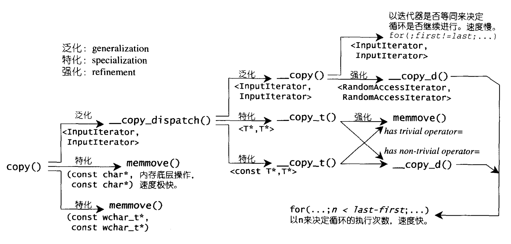

## copy

copy给客端的接口只有两个`InputIterator`和`OutputIterator`两个迭代器。通过内部的特化和泛化实现所有类型的copy操作。

- 对于有`trivial assignment operator`类型的数据，直接使用`memove`进行拷贝和赋值操作。
- 对于没有`trivial assignment operator`类型的数据，则分成两种
  - `__copy_d`:一种是接受随机访问的迭代器，计算迭代器之间的差值作为循环条件进行优化。
  - 一种是只能判断是否相等的迭代器，用是否相等作为循环条件（效率较低）