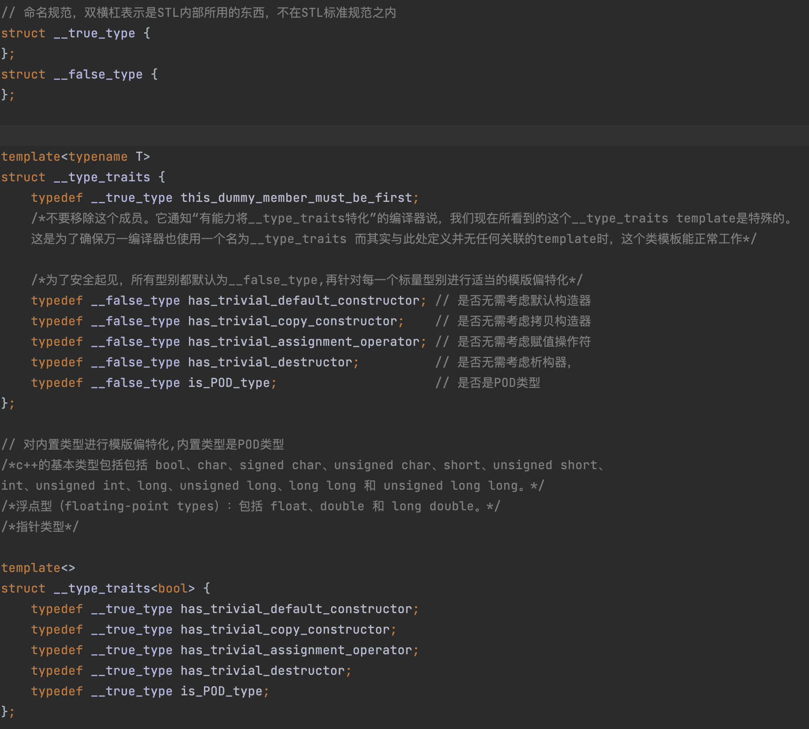
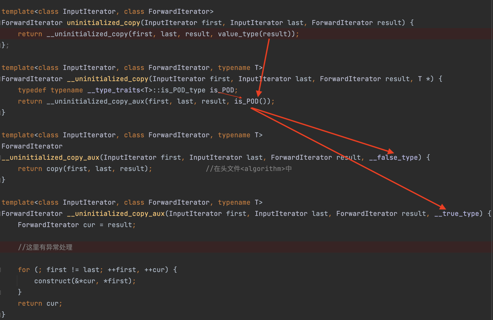

## 萃取机制

工作原理：

定义表示真假的两个空类：`struct __ture_type{};`和`struct __false_type{}`。空类不占用任何空间。

定义时：

定义一个模版类`__type_traits`。默认所有类型都是`__false_type`。然后对所有的内置类型进行模版偏特化：设定为`__true_type`。



使用时，只需使用`__type_traits<T>::`调用相应的模版的成员还是即可返回`__false_type`和`__true_type`，从而实现在传入类型的判断。然后调用对用的模版偏特化即可实现对类型的萃取。




​	SGI提供了一种机制，`__type_traits`。

- iterator_traits：负责萃取迭代器的特性
- __type_traits：负责萃取类型的特性，包括：
  - 该类型是否具备non-trivial default ctor
  - 该类型是否具备non-trivial copy ctor
  - 该类型是否具备non-trivial assignment operator
  - 该类型是否具备non-trivial dtor
  - 该类型是否是POD类型

通过使用__type_traits，在对某个类型进行构造、析构、拷贝、赋值等操作时，就可以采用最有效率的措施。这对于大规模而操作频繁的容器，有着显著的效率提升

萃取类型的特性时，我们希望得到一个”真“或”假“（以便决定采取什么策略），但其结果不应该只是个bool值，应该是个有着真/假性质的”对象”，因为我们希望利用响应的结果来进行参数推导，而编译器只有面对class object形式的参数，才会做**参数推导**，所以萃取类型的特性时，返回true_type或false_type：

```c++
struct __true_type { };
struct __false_type { };
```

**参数推导：**模板参数推导是指编译器根据函数调用时传递的参数类型推导出模板参数类型。

然后利用C++的模板参数特化，把内置数据类型返回`__true_type`。

**优点：**

- 在c++中，空结构体的大小为0；两个空白class没有任何成员，不占用任何内存空间。且能表示类型的真假性质。（使用bool类型最少占用一个字节的内存空间）
- C风格结构体也是POD，这样就不用管构造和析构
  - 结构体的创建和销毁都需要手动完成。常见的结构体创建和销毁方法包括通过结构体变量直接赋值、通过结构体指针动态分配内存和在函数中创建结构体实例并返回。
  - 和常规变量一样，当出了作用域之后，结构体的变量和数组会被自动销毁，但是，注意，结构体指针指向的空间，和结构体成员变量中的指针指向的空间，都不会被自动释放，需要手动释放。

```c++
/*
 * @Descripttion:
 * @version: 1.0
 * @Author: liangleilei
 * @Date: 2023-03-27 08:00:11
 * @LastEditTime: 2023-03-27 12:06:27
 */

// 命名规范，双横杠表示是STL内部所用的东西，不在STL标准规范之内
struct __true_type
{
};
struct __false_type
{
};


template <typename T>
struct __type_traits
{
    typedef __true_type this_dummy_member_must_be_first;
    /*不要移除这个成员。它通知“有能力将__type_traits特化”的编译器说，我们现在所看到的这个__type_traits template是特殊的。
    这是为了确保万一编译器也使用一个名为__type_traits 而其实与此处定义并无任何关联的template时，这个类模板能正常工作*/

    /*为了安全起见，所有型别都默认为__false_type,再针对每一个标量型别进行适当的模版偏特化*/
    typedef __false_type has_trivial_default_constructor; // 是否无需考虑默认构造器
    typedef __false_type has_trivial_copy_constructor;    // 是否无需考虑拷贝构造器
    typedef __false_type has_trivial_assignment_operator; // 是否无需考虑赋值操作符
    typedef __false_type has_trivial_destructor;          // 是否无需考虑析构器，
    typedef __false_type is_POD_type;                     // 是否是POD类型
};

// 对内置类型进行模版偏特化,内置类型是POD类型
/*c++的基本类型包括包括 bool、char、signed char、unsigned char、short、unsigned short、
int、unsigned int、long、unsigned long、long long 和 unsigned long long。*/
/*浮点型（floating-point types）：包括 float、double 和 long double。*/
/*指针类型*/

template <>
struct __type_traits<bool>
{
    typedef __true_type has_trivial_default_constructor;
    typedef __true_type has_trivial_copy_constructor;
    typedef __true_type has_trivial_assignment_operator;
    typedef __true_type has_trivial_destructor;
    typedef __true_type is_POD_type;
};

template <>
struct __type_traits<char>
{
    typedef __true_type has_trivial_default_constructor;
    typedef __true_type has_trivial_copy_constructor;
    typedef __true_type has_trivial_assignment_operator;
    typedef __true_type has_trivial_destructor;
    typedef __true_type is_POD_type;
};

template <>
struct __type_traits<signed char>
{
    typedef __true_type has_trivial_default_constructor;
    typedef __true_type has_trivial_copy_constructor;
    typedef __true_type has_trivial_assignment_operator;
    typedef __true_type has_trivial_destructor;
    typedef __true_type is_POD_type;
};

template <>
struct __type_traits<unsigned char>
{
    typedef __true_type has_trivial_default_constructor;
    typedef __true_type has_trivial_copy_constructor;
    typedef __true_type has_trivial_assignment_operator;
    typedef __true_type has_trivial_destructor;
    typedef __true_type is_POD_type;
};

template <>
struct __type_traits<short>
{
    typedef __true_type has_trivial_default_constructor;
    typedef __true_type has_trivial_copy_constructor;
    typedef __true_type has_trivial_assignment_operator;
    typedef __true_type has_trivial_destructor;
    typedef __true_type is_POD_type;
};

template <>
struct __type_traits<unsigned short>
{
    typedef __true_type has_trivial_default_constructor;
    typedef __true_type has_trivial_copy_constructor;
    typedef __true_type has_trivial_assignment_operator;
    typedef __true_type has_trivial_destructor;
    typedef __true_type is_POD_type;
};

template <>
struct __type_traits<int>
{
    typedef __true_type has_trivial_default_constructor;
    typedef __true_type has_trivial_copy_constructor;
    typedef __true_type has_trivial_assignment_operator;
    typedef __true_type has_trivial_destructor;
    typedef __true_type is_POD_type;
};

template <>
struct __type_traits<unsigned int>
{
    typedef __true_type has_trivial_default_constructor;
    typedef __true_type has_trivial_copy_constructor;
    typedef __true_type has_trivial_assignment_operator;
    typedef __true_type has_trivial_destructor;
    typedef __true_type is_POD_type;
};

template <>
struct __type_traits<long>
{
    typedef __true_type has_trivial_default_constructor;
    typedef __true_type has_trivial_copy_constructor;
    typedef __true_type has_trivial_assignment_operator;
    typedef __true_type has_trivial_destructor;
    typedef __true_type is_POD_type;
};

template <>
struct __type_traits<unsigned long>
{
    typedef __true_type has_trivial_default_constructor;
    typedef __true_type has_trivial_copy_constructor;
    typedef __true_type has_trivial_assignment_operator;
    typedef __true_type has_trivial_destructor;
    typedef __true_type is_POD_type;
};

template <>
struct __type_traits<long long>
{
    typedef __true_type has_trivial_default_constructor;
    typedef __true_type has_trivial_copy_constructor;
    typedef __true_type has_trivial_assignment_operator;
    typedef __true_type has_trivial_destructor;
    typedef __true_type is_POD_type;
};

template <>
struct __type_traits<unsigned long long>
{
    typedef __true_type has_trivial_default_constructor;
    typedef __true_type has_trivial_copy_constructor;
    typedef __true_type has_trivial_assignment_operator;
    typedef __true_type has_trivial_destructor;
    typedef __true_type is_POD_type;
};

template <>
struct __type_traits<float>
{
    typedef __true_type has_trivial_default_constructor;
    typedef __true_type has_trivial_copy_constructor;
    typedef __true_type has_trivial_assignment_operator;
    typedef __true_type has_trivial_destructor;
    typedef __true_type is_POD_type;
};

template <>
struct __type_traits<double>
{
    typedef __true_type has_trivial_default_constructor;
    typedef __true_type has_trivial_copy_constructor;
    typedef __true_type has_trivial_assignment_operator;
    typedef __true_type has_trivial_destructor;
    typedef __true_type is_POD_type;
};

template <>
struct __type_traits<long double>
{
    typedef __true_type has_trivial_default_constructor;
    typedef __true_type has_trivial_copy_constructor;
    typedef __true_type has_trivial_assignment_operator;
    typedef __true_type has_trivial_destructor;
    typedef __true_type is_POD_type;
};

// 对于原生指针类型进行偏特化
template <typename T>
struct __type_traits<T *>
{
    typedef __true_type has_trivial_default_constructor;
    typedef __true_type has_trivial_copy_constructor;
    typedef __true_type has_trivial_assignment_operator;
    typedef __true_type has_trivial_destructor;
    typedef __true_type is_POD_type;
};

```


