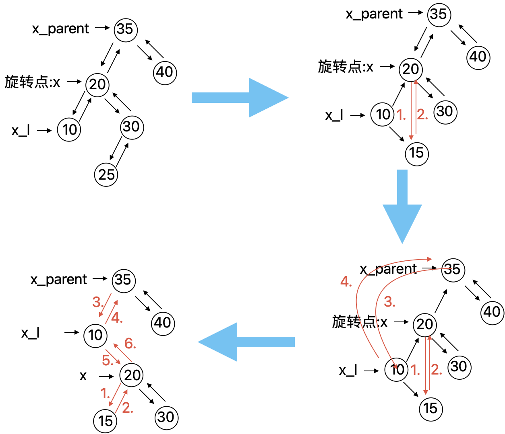

## 二叉排序树的删除

[参考文章](https://mp.weixin.qq.com/s/9-M9V12JBl41PiygZUgJ_w)

### 情况1

**被删除的结点D是叶子结点：直接从二叉排序树当中移除即可，也不会影响树的结构**


### 情况2

**被删除的结点D仅有一个孩子：如果只有左孩子，没有右孩子，那么只需要把要删除结点的左孩子链接到要删除结点的父亲节点，然后删除D结点就好了；如果只有右孩子，没有左孩子，那么只要将要删除结点D的右孩子重接到要删除结点D的父亲结点。**


### 情况3

**被删除结点的左右孩子都存在：**用被删除结点**左子树的值最大的结点**或**右子树中值最小的结点**替换要删除的结点的值，然后移除要删除的结点。


### 代码实现

```c++
struct node* deleteNode(struct node* root, int key)
{
 // 如为空，直接返回
 if (root == NULL) return root;

 // 如果删除的值小于 root 的值，则递归的遍历rootde左子树
 // 即删除结点位于左子树
 if (key < root->key)
  root->left = deleteNode(root->left, key);

 // 如果删除的值大于 root 的值，则递归的遍历root的右子树
 // 即删除结点位于右子树
 else if (key > root->key)
  root->right = deleteNode(root->right, key);

 // 如果值相等，则删除结点
 else
 {
  /*第一种情况可以包含在第二种当中，所以不做处理
   这里处理第二种情况*/

  //删除结点的左孩子为空
  if (root->left == NULL)
  {
   struct node *temp = root->right;
   if(root->key == 30){
                printf("%d\n",temp->key);
   }
   free(root);
   return temp;
  }
  else if (root->right == NULL)//删除结点的右孩子为空
  {
   struct node *temp = root->left;
   free(root);
   return temp;
  }

  // 左右孩子均不为空，获取删除结点中序遍历的直接后继结点 
  struct node* temp = minValueNode(root->right);

  // 将删除结点的值替换为直接后继结点的值
  root->key = temp->key;

  // 删除直接后继结点
  root->right = deleteNode(root->right, temp->key);

  /* 或者获取删除结点中序遍历的直接前驱结点。*/
  //struct node* temp = maxValueNode(root->left);
  // root->key = temp->key;
  //root->left = deleteNode(root->left, temp->key);

 }
 return root;
}
```


### 时间复杂度

二叉排序树的插入和查找、删除操作的最坏时间复杂度为 ，其中 h 是二叉排序树的高度。


## 红黑树的左旋和右旋操作

### 左旋

- 先把旋转点x的右孩子x_r的左子树连接到旋转点的右子树
- 再把旋转点x的的右孩子x_r及其右子树连接到x的父节点
- 最后把旋转点x连接到x_r的左子树


代码如下：

```c++
//左旋操作
inline void __rb_tree_rotate_left(__rb_tree_node_base *x,__rb_tree_node_base *&root) {
    __rb_tree_node_base *x_r = x->right;
    x->right = x_r->left;
    if (x_r->left != 0) {               //情况1
        x_r->left->parent = x;
    }
    x_r->parent = x->parent;

    if (x == root) {
        root = x_r;
    } else if (x == x->parent->left) {
        x->parent->left = x_r;
    } else {
        x->parent->right = x_r;
    }
    x_r->left = x;
    x->parent = x_r;
}

```


### 右旋：

- 先把旋转点x的左孩子x_l的左子树连接到旋转点的左子树
- 再把旋转点x的的左孩子x_l及其左子树连接到x的父节点
- 最后把旋转点x连接到x_l的右子树



源码为：

```c++
//右旋操作
inline void __rb_tree_rotate_right(__rb_tree_node_base *x, __rb_tree_node_base *&root) {
    __rb_tree_node_base *x_l = x->left;
    x->left = x_l->right;
    if (x_l->right != 0) {
        x_l->right->parent = x;
    }
    x_l->parent = x->parent;

    if (x == root) {
        root = x_l;
    } else if (x == x->parent->right) {
        x->parent->right = x_l;
    } else {
        x->parent->left = x_l;
    }
    x_l->right = x;
    x->parent = x_l;

}
```


## 红黑树的删除

首先我们假定要删除的结点为 y ，x 是用来替换 y 的孩子结点。当y是叶子结点时，x是NULL结点，NULL节点当作黑色结点处理。


删除操作总纲：

1. 执行标准的 BST 的删除操作（上面的操作就是）
2. 简单情况：x 或者 y 是红色（移除y后,把x标记为黑色）
3. 复杂情况：x 和 y 都是黑色结点。


### 1.先执行标准的BST的删除操作

```c++
inline __rb_tree_node_base*
    _rb_tree_rebalance_for_erase(__rb_tree_node_base *z,
                                 __rb_tree_node_base *&root,
                                 __rb_tree_node_base *&leftmost,
                                 __rb_tree_node_base *&rightmost) {
    __rb_tree_node_base *y = z;             //要删除的节点
    __rb_tree_node_base *x = 0;             //要替换的节点
    __rb_tree_node_base *x_parent = 0;
    ///标准的二叉搜索树删除流程
    //要删除节点有一个子孩子的情况,直接用其子孩子替换
    if (y->left == 0) {
        x = y->right;
    } else {
        if (y->right == 0) {
            x = y->left;
        } else {           //要删除节点的左右孩子均有的情况
            y = y->right;
            while (y->left != 0) {              //找到右子树值最小的节点
                y = y->left;
            }       //循环结束时，y是右子树的最小节点，将用来替换z
            x = y->right;       //x可能是null
        }
    }

    //当y != z时，要删除的节点左右孩子均有
    if (y != z) {     //用y代替z，y是z的继任者，重新链接y。
        z->left->parent = y;        //因为上面替换的是右子树的最小值，有可能是z的右孩子,所以先把z的左子树连接到y
        y->left = z->left;
        if (y != z->right) {
            x_parent = y->parent;                   //后面移除y时用到
            if (x) {    //把y从原来的位置拿掉，用x替换，此时x_parent是y的父节点
                x->parent = y->parent;
            }
            y->parent->left = x;
            y->right = z->right;        //用y替换z
            z->right->parent = y;
        } else {       //y是z的右孩子，z的右子树只有这一个y节点
            x_parent = y;			
        }
        if (root = z) {		//用y来替换z
            root = y;
        } else if (z->parent->left = z) {
            z->parent->left = y;
        } else {
            z->parent->right = y;
        }
        y->parent = z->parent;
        mystl::swap(y->color, z->color);		//颜色也要替换
        y = z;          //y现在指向实际要删除的节点
    } else {       //y == z;   说明只有z结点只有一个子节点x,x要替换z,且有可能是最大值或最小值
        x_parent = y->parent;			
        if (x) {		//用x来替换y
            x->parent = y->parent;
        }
        if (root == y) {
            root = x;
        } else {
            if (y->parent->left == y) {
                y->parent->left = x;
            } else {
                y->parent->right = x;
            }								//x_parent是x的父节点
        }
        //更新header的指针
        if (leftmost == z) {            //如果z是最小值
            if (z->right == 0) {
                leftmost = z->parent;
            } else {
                leftmost = __rb_tree_node_base::minimum(x);
            }
        }
        if (rightmost == z) {
            if (z->left == 0) {
                rightmost = z->parent;
            } else {
                rightmost = __rb_tree_node_base::maximum(x);
            }
        }

    ...
}        
```

**上面的程序结束时**

- 要移除的节点y已经转移到红黑树的叶子节点
- x节点已经完成了对y 节点的替换
- x_parent指向x的父节点。


### 2.简单情况：x或者y是红色

移除y，把x标记为黑色

源码为：

```c++
if (__y->_M_color != _S_rb_tree_red) { 
    while (__x != __root && (__x == 0 || __x->_M_color == _S_rb_tree_black)){
    	...
    }
    if (x) x->color = __rb_tree_black;
}
```

### 3.复杂情况：x和y都是黑色结点。

**在本文的示例中，y是要移除的节点，y没有左右子树，所以用空节点替换。y的位置实际上也是x。**


**a .y的兄弟结点 w 是红色结点**

**b.y 的兄弟结点 w 是黑色且 w 的两个孩子结点都是黑色**

**c.y 的兄弟结点 w 是黑色且 w 的孩子结点至少有一个是红色**

**d.兄弟节点w为黑，且w的左节点不存在或为黑，右节点为红**

**e.x是根节点的情况：直接返回y进行移除，从所有路径去除了一个黑色节点，而新根是黑色的，所以性质都保持着。**


#### **a. y 为黑，y的兄弟结点 w 是红色结点**4

删除y之后，会破坏红黑树的条件4（任一节点至 NULL（树尾端）的任何路径，所含之黑节点数必须相同。）

1. 对调兄弟节点w和x_parent的颜色
2. 以x_parent为旋转节点进行右旋

完成以上两个操作后，尽管所有路径上黑色结点的树目并没有改变，但x有了一个黑色的兄弟和一个红色的父亲，接下来的情况按照b,c,d处理。


可以看出把y移除后，这个红黑树满足所有条件

对应源码：

```C++
while (x != root && (x == 0 || x->color == __rb_tree_black)) {          //x是要替换y的节点，满足该条件的x是双黑节点
    if (x == x_parent->left) {      //如果x是父节点的左孩子，
       ...
        //对于右节点的操作是对称的
    } else {
        __rb_tree_node_base *w = x_parent->left;       //w记录要删除节点的兄弟节点
        if (w->color == __rb_tree_red) {      //兄弟节点为父节点的右节点且为红，破坏了条件4，左旋
            w->color = __rb_tree_black;
            x_parent->color = __rb_tree_red;
            __rb_tree_rotate_right(x_parent, root);
            w = x_parent->left;
        }
        //兄弟节点为黑，且兄弟节点的左孩子和右孩子均为黑色，也对应上面的情况b
        if ((w->right == 0 || w->right->color == __rb_tree_black)
            && (w->left == 0 || w->left->color == __rb_tree_black)) {
            w->color = __rb_tree_red;
            x = x_parent;
            x_parent = x_parent->parent;        //之后递归的进行操作
        } 
} 
if (x) x->color = __rb_tree_black;
```

#### **b. y 的兄弟结点 w 是黑色且 w 的两个孩子结点都是黑色**

把w标记为红色，这样会满足条件4。但可能会出现父子节点都为红色的情况，需要递归的往上执行。


#### **c.兄弟节点w为黑色，w的左子节点为红色或左右节点均为红色。**

把w左孩子的颜色标记为为黑色，以x_parent为旋转点右旋即可。


源码为：

```c++
 while (x != root && (x == 0 || x->color == __rb_tree_black)) {          //x是要替换y的节点，满足该条件的x是双黑节点
    if (x == x_parent->left) {      //如果x是父节点的左孩子，
       ...
        //对于右节点的操作是对称的
    } else {
        __rb_tree_node_base *w = x_parent->left;       //w记录要删除节点的兄弟节点
        if (w->color == __rb_tree_red) {      //兄弟节点为父节点的右节点且为红，破坏了条件4，左旋
            w->color = __rb_tree_black;
            x_parent->color = __rb_tree_red;
            __rb_tree_rotate_right(x_parent, root);
            w = x_parent->left;
        }
        //兄弟节点为黑，且兄弟节点的左孩子和右孩子均为黑色，也对应上面的情况b
        if ((w->right == 0 || w->right->color == __rb_tree_black)
            ...
        }else {
          if (__w->_M_left == 0 || 
              __w->_M_left->_M_color == _S_rb_tree_black) {
              ...
          }
          __w->_M_color = __x_parent->_M_color;
          __x_parent->_M_color = _S_rb_tree_black;
          if (__w->_M_left) __w->_M_left->_M_color = _S_rb_tree_black;
          _Rb_tree_rotate_right(__x_parent, __root);
          break;
        } 
} 
if (x) x->color = __rb_tree_black;
```


#### **d. 兄弟节点w为黑，且w的左节点不存在或为黑，右节点为红**

对调w和其右孩子的颜色，然后以w为旋转点右旋。得到情况c。根据情况c操作即可。


源码为：

```c++
while (x != root && (x == 0 || x->color == __rb_tree_black)) {          //x是要替换y的节点，满足该条件的x是双黑节点
    if (x == x_parent->left) {      //如果x是父节点的左孩子，
       ...
        //对于右节点的操作是对称的
    } else {
        __rb_tree_node_base *w = x_parent->left;       //w记录要删除节点的兄弟节点
        if (w->color == __rb_tree_red) {      //兄弟节点为父节点的右节点且为红，破坏了条件4，左旋
            w->color = __rb_tree_black;
            x_parent->color = __rb_tree_red;
            __rb_tree_rotate_right(x_parent, root);
            w = x_parent->left;
        }
        //兄弟节点为黑，且兄弟节点的左孩子和右孩子均为黑色，也对应上面的情况b
        if ((w->right == 0 || w->right->color == __rb_tree_black)
            ...
        }else {
          if (__w->_M_left == 0 || 
              __w->_M_left->_M_color == _S_rb_tree_black) {
            if (__w->_M_right) __w->_M_right->_M_color = _S_rb_tree_black;
            __w->_M_color = _S_rb_tree_red;
            _Rb_tree_rotate_left(__w, __root);
            __w = __x_parent->_M_left;
          }
          __w->_M_color = __x_parent->_M_color;
          __x_parent->_M_color = _S_rb_tree_black;
          if (__w->_M_left) __w->_M_left->_M_color = _S_rb_tree_black;
          _Rb_tree_rotate_right(__x_parent, __root);
          break;
        } 
} 
if (x) x->color = __rb_tree_black;
```


完整的删除源码：

```c++
///erase
template<class Key, class Value, class KeyOfValue, class Compare, class Alloc>
    inline void _rb_tree<Key, Value, KeyOfValue, Compare, Alloc>
    ::erase(iterator position) {
        link_type y = (link_type) _rb_tree_rebalance_for_erase(position.node,
                                                               header->parent,
                                                               header->left,
                                                               header->right);
        destroy_node(y);        //y为能安全删除的节点
        --node_count;
    }
inline __rb_tree_node_base 
    *_rb_tree_rebalance_for_erase(__rb_tree_node_base *z,
                                  __rb_tree_node_base *&root,
                                  __rb_tree_node_base *&leftmost,
                                  __rb_tree_node_base *&rightmost) {
    __rb_tree_node_base *y = z;             //要删除的节点
    __rb_tree_node_base *x = 0;             //要替换的节点
    __rb_tree_node_base *x_parent = 0;
    ///标准的二叉搜索树删除流程
    //要删除节点有一个子孩子的情况
    if (y->left == 0) {
        x = y->right;
    } else {
        if (y->right == 0) {
            x = y->left;
        } else {           //要删除节点的左右孩子均有的情况
            y = y->right;
            while (y->left != 0) {              //找到右子树值最小的节点
                y = y->left;
            }       //循环结束时，y是右子树的最小节点，将用来替换z
            x = y->right;       //x可能是null
        }
    }

    //当y != z时，要删除的节点左右孩子均有
    if (y != z) {     //用y代替z，y是z的继任者，重新链接y。
        z->left->parent = y;        //因为上面替换的是右子树的最小值，有可能是z的右孩子,所以先把z的左子树连接到y
        y->left = z->left;
        if (y != z->right) {
            x_parent = y->parent;                   //后面移除y时用到
            if (x) {    //要把y的右子树连接到y的父节点
                x->parent = y->parent;
            }
            y->parent->left = x;
            y->right = z->right;        //用y替换z
            z->right->parent = y;
        } else {       //y是z的有孩子
            x_parent = z;
        }
        if (root = z) {
            root = y;
        } else if (z->parent->left = z) {
            z->parent->left = y;
        } else {
            z->parent->right = y;
        }
        y->parent = z->parent;
        mystl::swap(y->color, z->color);
        y = z;          //y现在指向实际要删除的节点
    } else {       //y == z;   说明只有z结点只有一个子节点x,x要替换z,且有可能是最大值或最小值
        x_parent = y->parent;
        if (x) {
            x->parent = y->parent;
        }
        if (root == z) {
            root = x;
        } else {
            if (z->parent->left == z) {
                z->parent->left = x;
            } else {
                z->parent->right = x;
            }
        }
        //更新header的指针
        if (leftmost == z) {            //如果z是最小值
            if (z->right == 0) {
                leftmost = z->parent;
            } else {
                leftmost = __rb_tree_node_base::maximum(x);
            }
        }
        if (rightmost == z) {
            if (z->left == 0) {
                rightmost = z->parent;
            } else {
                rightmost = __rb_tree_node_base::maximum(x);
            }
        }

    }//经过标准的二叉树删除处理后，y指向要删除的节点，且有x_parent指向y节点的父节点

    if (y->color != __rb_tree_red) {      //y为黑，移除会破坏了红黑树的条件4
        while (x != root && (x == 0 || x->color == __rb_tree_black)) {          //x是要替换y的节点，满足该条件的x是双黑节点
            if (x == x_parent->left) {      //如果x是父节点的左孩子，
                __rb_tree_node_base *w = x_parent->right;       //w记录要删除节点的兄弟节点
                if (w->color == __rb_tree_red) {      //兄弟节点为父节点的右节点且为红，破坏了条件4，左旋
                    w->color = __rb_tree_black;
                    x_parent->color = __rb_tree_red;
                    __rb_tree_rotate_left(x_parent, root);
                    w = x_parent->right;
                }
                //兄弟节点为黑，且兄弟节点的左孩子和右孩子均为黑色
                if ((w->left == 0 || w->left->color == __rb_tree_black)
                    && (w->right == 0 || w->right->color == __rb_tree_black)) {
                    w->color = __rb_tree_red;
                    x = x_parent;
                    x_parent = x_parent->parent;        //之后递归的进行操作
                } else {
                    //兄弟节点的子节点有一个是红色
                    if (w->right == 0 || w->right->color == __rb_tree_black) {      //如果左子节点是红，内侧，先右旋再左旋
                        if (w->left) w->left->color = __rb_tree_black;
                        w->color = __rb_tree_red;
                        __rb_tree_rotate_right(w, root);
                        w = x_parent->right;
                    }

                    // 右节点为红
                    w->color = x_parent->color;
                    x_parent->color = __rb_tree_black;
                    if (w->right) w->right->color = __rb_tree_black;
                    __rb_tree_rotate_left(x_parent, root);
                    break;
                }
                //对于右节点的操作是对称的
            } else {
                __rb_tree_node_base *w = x_parent->left;       //w记录要删除节点的兄弟节点
                if (w->color == __rb_tree_red) {      //兄弟节点为父节点的右节点且为红，破坏了条件4，左旋
                    w->color = __rb_tree_black;
                    x_parent->color = __rb_tree_red;
                    __rb_tree_rotate_right(x_parent, root);
                    w = x_parent->left;
                }
                //兄弟节点为黑，且兄弟节点的左孩子和右孩子均为黑色
                if ((w->right == 0 || w->right->color == __rb_tree_black)
                    && (w->left == 0 || w->left->color == __rb_tree_black)) {
                    w->color = __rb_tree_red;
                    x = x_parent;
                    x_parent = x_parent->parent;        //之后递归的进行操作
                } else {
                    //兄弟节点的子节点有一个是红色
                    if (w->left == 0 || w->left->color == __rb_tree_black) {      //如果兄弟节点的右子节点是红，内侧，先左旋再右旋
                        if (w->right) w->right->color = __rb_tree_black;
                        w->color = __rb_tree_red;
                        __rb_tree_rotate_left(w, root);
                        w = x_parent->left;
                    }

                    // 右节点为红
                    w->color = x_parent->color;
                    x_parent->color = __rb_tree_black;
                    if (w->left) w->left->color = __rb_tree_black;
                    __rb_tree_rotate_right(x_parent, root);
                    break;
                }
            }
        }
        if (x) x->color = __rb_tree_black;

    }
    return y;

}
```


