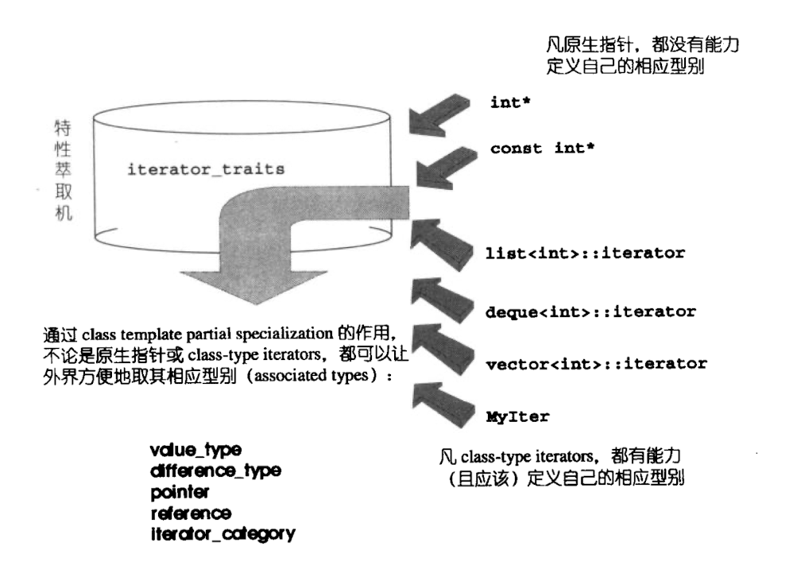
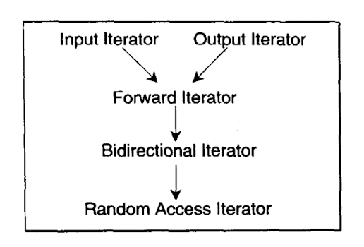

## 中心思想

STL的中心思想就是：将数据容器和算法分开，彼此独立设计，最后再用一个”东西“将他们撮合在一起。迭代器可以将两者很好的联系起来。


### **迭代器是一种smart pointer**

**迭代器是一种行为类似指针的对象**，而指针的各种行为中最常见也是最重要的是内容提领(dereference)和成员访问(member access)，因此，迭代器最终要的编程工作就是对`operator*`和`operator->`进行重载工作。


### 迭代器相应型别

在算法中运用迭代器时，很可能用到迭代器所指之物的型别。该型别可以在函数中定义变量，也可以作为函数的返回值。

举例所示：

```c++
template<class I,class T>
void func_impl(I iter,T t){
	T tmp;		//T就是迭代器所指之物的型别。
}

template<class I>
inline void func(I iter){
	func_impl(iter,*iter);
}

int main(){
	int i;
	func(&i);
}
```

以func()为对外接口，却把实力操作全部置于func_impl()之中。由于Func_impl()是一个function template,一旦被调用，编译器会自动进行模版参数推到。于是导出型别T。


但上述的参数传递在value type必须用于函数的返回值时就实现了。因为函数的“template 参数推导机制”只能用于参数，不能推到函数的返回值型别。解决方法如下：

```c++
template <class T>
struct MyIter{
	typedef T value_type;		//内嵌型别声明
	T* ptr;
	Myiter(T* p=0):ptr(p){ }
	T& operator*()const{ return *ptr;}
	
}

template<class T>
typename T::value_type func(I ite){
	return *ite;
}

MyIter<int> ite(new int(8));
cout<<func(ite);	//输出8
```

这有个陷阱，并不是所有的迭代器都是`class type`，比如原生指针。如果不是`class`类型，就不能定义内嵌型别。就需要对这种情况（原生指针）做特殊化处理。这就需要用到**模版偏特化**。


## 模版偏特化

假设一个类模版：

`template<typename U,typename V,typename T>`

`class C{...};`

模版偏特化并不一定是对模版参数`U`或`V`或`T`指定某个参数值。《泛型思维》一书中对于`partial specialization`的定义是：“针对（任何）模版参数更进一步的条件限制所设计出来的一个特化版本。”由此：

`template<typename T>`

`class C{...};				//这个泛化版本接收T为任何型别`

对上面的模版类的一个偏特化版本为：

`template<typename T>`

`class C<T*>{...};			//这个特化版本适用于T为原生指针的情况`


### iterator_traits



```c++
template<class I>
struct iterator_traits {
    typedef typename I::iterator_category iterator_category;
    typedef typename I::value_type value_type;
    typedef typename I::difference_type difference_type;
    typedef typename I::pointer pointer;
    typedef typename I::reference reference;
};
```

## 迭代器型别

- `value type`:迭代器所指对象的型别。
- `difference type`:表示迭代器之间的额距离
- `reference type`:这个类型在迭代器操作时可能会改变迭代器所指的对象。分两种情况：
  - 迭代器类型是`mutable iterator`,`reference type`的类型就是`T&`。
  - 迭代器类型是`constant iterator`,`reference type`的类型是`const T&`

- `pointer type`:返回一个指针，指向迭代器所指的对象。
- `iterator_category`:迭代器类型。分为5类，会引发大量的代码工程。
  - `Input Iterator`:这种迭代器所指的对象，不允许外界改变。只读。
  - `Output Iterator`:这种迭代器所指的对象，只写。
  - `Forward Iteraot`:允许“写入型”算法（例如replace）在此种迭代器所形成的区间上进行读写操作。
  - `BidIrectional Iterator`:可双向移动。某些算法需要你想走访某个迭代器区间（例如逆向拷贝某范围内的元素），可以使用`BidIrectional Iterator`
  - `Random Access Iterator`:前四种迭代器只供应一部分指针算术能力（前三种只支持`operator++`,第四种再加上`operator--`）,第五种则覆盖所有指针算术能力，包括`p+n,p-n,p[n],p1-p2,p1<p2`。


### 迭代器的分类和从属关系：



任何一个迭代器，其类型永远应该落在"迭代器所隶属之各种类型中，最强化的那个"

```c++
struct input_iterator_tag {
};
struct output_iterator_tag {
};
struct forward_iterator_tag : public input_iterator_tag {
};
struct bidirectional_iterator_tag : public forward_iterator_tag {
};
struct random_access_iterator_tag : public bidirectional_iterator_tag {
};
```

### 消除“传递调用的函数”

以`class`来定义迭代器的各种分类标签，不仅可以促成重载机制的成功运作。另一个好处是，通过继承，我们可以不必再写"单纯只做传递调用"函数。参数与参数没有完全匹配时，可以根据继承关系自动传递调用。

```c++
//仿真测试 tag types 继承关系所带来的影晌
#include <iostream> 
using namespace std;
struct B { };					// B可比拟为 Input Iterator
struct D1 : public B { };		// D1可比拟为 ForwaraIterator
struct D2: public D1 { };		// D2可比拟为 Bidirect ionalIterator

template <class I> 
void func (I& D, B)
{ cout << "B version" << endl; }
template <class I> 
void func (I& p, D2)
{ cout << "D2 version" << endi; }  
int main ()
{
int* p;
func(p, B();		//参数与参数完全吻合。输出："B version"
func (p, D1())；		//参数与参数未能完全吻合；因继承关系而自动传递调用
					//输出："B version"
func(p, D2());		//参数与参数完全吻合。输出："D2 version"
}
```


### std::iterator的保证

任何迭代器都应该提供五个内嵌相应型别，以利于`traits`萃取，否则自别于整个STL架构。

为了简化操作，STL提供了一个`iterator class`,如果每个新设计的迭代器都继承自它，就可保证符合STL所需之规范：

```c++
template<class Category,
		 class T,
		 class Distance = ptrdiff_t,
		 class Pointer = T*,
		 class Reference = T&>
struct iterator{
	typedef Category	iterator_category;
	typedef T			value_type;
	typedef Distance	difference_type;
	typedef Pointer		pointer;
	typedef Reference	reference;
};
```


**`static_cast<typename iterator_traits<Iterator>::difference_type *>(0)`**

这是一个C++表达式，使用了`static_cast`将空指针转换为类型为`typename iterator_traits<Iterator>::difference_type*`的指针。

`typename iterator_traits<Iterator>::difference_type`是一个类型特征，表示类型为`Iterator`的迭代器之间的距离。它用于计算两个迭代器之间的距离，通常是有符号整数类型的别名。

这个代码中的`static_cast`表达式通常用于获取适当类型的空指针，以便对迭代器进行指针运算。例如，在表达式`it + n`中，其中`it`是一个迭代器，`n`是一个整数，`n`会隐式转换为类型为`typename iterator_traits<Iterator>::difference_type`的值，将`n`添加到迭代器`it`的地址中，从而得到结果指针。然而，如果`n`为零，则结果指针也将是指向迭代器类型的指针，这可能与程序中使用的其他类型的指针不兼容。通过首先将空指针转换为适当的指针类型，可以在迭代器的指针运算中安全地使用结果指针。


```c++
//
// Created by 梁磊磊 on 2023/4/20.
//

#ifndef IMPLTMENT_STL_STL_ITERATOR_H
#define IMPLTMENT_STL_STL_ITERATOR_H

#ifndef INCLUDE_CSTDDEF_H
#define INCLUDE_CSTDDEF_H

#include "cstddef"

#endif


//五个作为标记用的型别,只作为标记用
struct input_iterator_tag {
};
struct output_iterator_tag {
};
struct forward_iterator_tag : public input_iterator_tag {
};
struct bidirectional_iterator_tag : public forward_iterator_tag {
};
struct random_access_iterator_tag : public bidirectional_iterator_tag {
};

template<class Category,
        class T,
        class Distance = ptrdiff_t,
        class Pointer = T *,
        class Reference = T &>
struct iterator {
    typedef Category iterator_category;
    typedef T value_type;
    typedef Distance difference_type;
    typedef Pointer pointer;
    typedef Reference reference;
};

//萃取出容器的迭代器相应的型别：必须对pointer类型和poniter-to-const设计特化版本
template<class I>
struct iterator_traits {
    typedef typename I::iterator_category iterator_category;
    typedef typename I::value_type value_type;
    typedef typename I::difference_type difference_type;
    typedef typename I::pointer pointer;
    typedef typename I::reference reference;
};


//针对原生指针设计的traits偏特化版本
template<class T>
struct iterator_traits<T *> {
    typedef random_access_iterator_tag iterator_category;
    typedef T value_type;
    typedef ptrdiff_t difference_type;
    typedef T *pointer;
    typedef T &reference;
};

//针对原生指针 pointer-to-const而设计的traits偏特化版
template<class T>
struct iterator_traits<const T *> {
    typedef random_access_iterator_tag iterator_category;
    typedef T value_type;
    typedef ptrdiff_t difference_type;
    typedef const T *pointer;
    typedef const T &reference;
};

/**这个函数可以很方便地决定某个迭代器的类型*/
template<class Iterator>
inline typename iterator_traits<Iterator>::iterator_category
iterator_category(const Iterator &) {
    typedef typename iterator_traits<Iterator>::iterator_category category;
    return category();         //这个是struct random_access_iterator_tag 类的构造函数
}

//这个函数可以决定某个迭代器的distance type
template<class Iterator>
inline typename iterator_traits<Iterator>::difference_type *
distance_type(const Iterator &) {
    //强制转换类型
    return static_cast<typename iterator_traits<Iterator>::difference_type *>(0);
}


//这个函数可以决定某个迭代器的value type
//这个函数的实际作用是提供一个编译时的类型检查，可以用来确定迭代器的值类型。
template<class Iterator>
inline typename iterator_traits<Iterator>::value_type *
value_type(const Iterator &) {
    return static_cast<typename iterator_traits<Iterator>::value_type *>(0);
}

/**以下的整组的distance函数*/
template<class InputIterator>
inline typename iterator_traits<InputIterator>::difference_type
__distance(InputIterator first, InputIterator last, random_access_iterator_tag) {
    return last - first;
}


template<class InputIterator>
inline typename iterator_traits<InputIterator>::difference_type
__distance(InputIterator first, InputIterator last, input_iterator_tag) {
    typename iterator_traits<InputIterator>::difference_type n = 0;
    while (first != last) {
        ++first;
        ++n;
    }
    return n;
}

template<class InputIterator>
inline typename iterator_traits<InputIterator>::difference_type
distance(InputIterator first, InputIterator last) {
    typedef typename iterator_traits<InputIterator>::iterator_category category;
    return __distance(first, last, category());
}

/**下列是整组的advance函数,表示迭代器移动n个位置*/
template<class InputIterator, class Distance>
inline void __advance(InputIterator &i, Distance n, input_iterator_tag) {
    while (n--) ++i;
}

template<class Bidirectional_iterator, class Distance>
inline void __advance(Bidirectional_iterator &i, Distance n, bidirectional_iterator_tag) {
    if (n >= 0)
        while (n--) ++i;
    else
        //n!=0,就会一直执行
        while (n++) --i;
}

template<class Random_access_iterator, class Distance>
inline void __advance(Random_access_iterator &i, Distance n, random_access_iterator_tag) {
    i += n;
}

template<class InputIterator, class Distance>
inline void advance(InputIterator &i, Distance n) {

    __advance(i, n, iterator_category(i));
}


#endif //IMPLTMENT_STL_STL_ITERATOR_H

```


## 反向迭代器

### `reference operator*() const`

反向迭代器返回正向迭代器的前一个元素，是因为反向迭代器的遍历方向是从容器的末尾到开头，而正向迭代器的遍历方向是从容器的开头到末尾。为了保持遍历方向的一致性，反向迭代器返回的是正向迭代器的前一个元素。

例如，假设有一个包含 `{1, 2, 3, 4, 5}` 的 vector 容器。正向迭代器从开头开始遍历时，第一个元素是 `1`，最后一个元素是 `5`。而反向迭代器从末尾开始遍历时，第一个元素应该是 `5`，最后一个元素应该是 `1`。因此，当反向迭代器返回正向迭代器的前一个元素时，遍历顺序就能够保持一致。

需要注意的是，反向迭代器的 `operator*()` 函数返回的是正向迭代器的前一个元素，但是其它成员函数（如 `operator++()` 和 `operator--()`）仍然是按照反向遍历的顺序实现的。

```c++
template<class Iterator>
    class reverse_iterator {
    private:
        Iterator current;       //记录对应的正向迭代器

    public:
        //反向迭代器的五种相应型别
        typedef typename iterator_traits<Iterator>::iterator_category iterator_category;
        typedef typename iterator_traits<Iterator>::value_type value_type;
        typedef typename iterator_traits<Iterator>::difference_type difference_type;
        typedef typename iterator_traits<Iterator>::reference reference;
        typedef typename iterator_traits<Iterator>::pointer pointer;

        typedef Iterator iterator_type;
        typedef reverse_iterator<Iterator> self;

    public:
        //构造函数
        reverse_iterator() {}

        explicit reverse_iterator(iterator_type i) : current(i) {}

        reverse_iterator(const self &rhs) : current(rhs.current) {}

    public:
        //取出对应的正向迭代器
        iterator_type base() const {
            return current;
        }

        //重载操作符
        reference operator*() const {
            auto tmp = current;
            return *--tmp;
        }

        pointer operator->() const {
            return &(operator*());
        }

        //前进变为后退
        self &operator++() {
            --current;
            return *this;
        }

        self operator++(int) {
            self tmp = *this;
            --current;
            return tmp;
        }

        //后退变前进
        self &operator--() {
            ++current;
            return *this;
        }

        self &operator--(int) {
            self tmp = *this;
            ++current;
            return tmp;
        }

        self &operator+=(difference_type n) {
            current -= n;
            return *this;
        }

        //operator+不改变本迭代器的current，而是先将当前迭代器的指针 current 向前移动 n 个位置，
        //得到新的指针位置。然后使用 self 类型的构造函数创建一个新的迭代器对象，并将新指针位置作为参数传入构造函数。最后，将新的迭代器对象返回。
        //函数后面根const，就意味着不会修改任何成员变量的值
        self operator+(difference_type n) const {
            return self(current - n);
        }

        self &operator-=(difference_type n) {
            current += n;
            return *this;
        }

        self operator-(difference_type n) const {
            return self(current + n);
        }

        reference operator[](difference_type n) const {
            return *(*this + n);
        }


    };

    //为逆向迭代器重载操作符
    template<class Iterator>
    typename reverse_iterator<Iterator>::difference_type
    operator-(const reverse_iterator<Iterator> &lhs, const reverse_iterator<Iterator> &rhs) {
        return rhs.base() - lhs.base();
    }

    template<class Iterator>
    bool operator==(const reverse_iterator<Iterator> &lhs, const reverse_iterator<Iterator> &rhs) {
        return lhs.base() == rhs.base();
    }

    template<class Iterator>
    bool operator!=(const reverse_iterator<Iterator> &lhs, const reverse_iterator<Iterator> &rhs) {
        return lhs.base() != rhs.base();
    }

    //逆序的左小于右等价于正序的右小于左
    template<class Iterator>
    bool operator<(const reverse_iterator<Iterator> &lhs, const reverse_iterator<Iterator> &rhs) {
        return rhs.base() < lhs.base();
    }

    template<class Iterator>
    bool operator>(const reverse_iterator<Iterator> &lhs, const reverse_iterator<Iterator> &rhs) {
        return rhs < lhs;
    }

    template<class Iterator>
    bool operator<=(const reverse_iterator<Iterator> &lhs, const reverse_iterator<Iterator> &rhs) {
        return !(rhs < lhs);
    }

    template<class Iterator>
    bool operator>=(const reverse_iterator<Iterator> &lhs, const reverse_iterator<Iterator> &rhs) {
        return !(lhs < rhs);
    }
```


## 萃取某种迭代器

### 模板元编程

模板元编程是一种使用 C++ 模板技术进行编程的方法，它将模板和编译时计算结合起来，实现在编译时进行计算和处理的功能。模板元编程通常用于编写类型安全、高效、通用的算法和数据结构，以及进行静态检查和优化。

在模板元编程中，模板被用来生成代码，这些代码在编译时生成并被编译器优化，而不是在运行时生成。这种技术可以提高程序的性能和可靠性，因为它允许编译器在编译时进行优化和检查，而不是在运行时产生错误或性能问题。

模板元编程的主要特点是它使用了模板元函数和模板元类。**模板元函数是指在编译时进行计算的函数，它们的参数和返回值都是类型而不是值。**模板元类是指在编译时生成的类，它们的成员函数和成员变量都是在编译时计算出来的。

模板元编程的一些常见应用包括编译时类型检查、代码生成、元编程库的开发、模板元算法的编写等。模板元编程需要对 C++ 模板的语法和语义有深入的理解，并且需要熟练掌握模板元编程技术和编译器的优化技术。

```c++
template <class T>
struct has_iterator_cat
{
private:
  struct two { char a; char b; };
  template <class U> static two test(...);
  template <class U> static char test(typename U::iterator_category* = 0);
public:
  static const bool value = sizeof(test<T>(0)) == sizeof(char);
};
```

这是一段 C++ 的模板元编程代码，用于检查给定类型 `T` 是否具有嵌套类型 `iterator_category`。

`has_iterator_cat` 结构体是一个类型特征，它提供了一个静态常量布尔成员 `value`，如果 `T` 有一个 `iterator_category` 类型，则为 true，否则为 false。

`has_iterator_cat` 特征的实现使用了 SFINAE (Substitution Failure Is Not An Error) 技术来检查 `iterator_category` 成员类型是否存在。

`two` 结构体定义了两个 `char` 成员 `a` 和 `b`。`test` 函数被重载了两个版本，一个接受任何类型(`...`)，另一个接受一个具有嵌套类型 `iterator_category` 的类型 `U` 的指针。由于 C++ 的重载解析规则，优先选择具有指针参数的 `test` 函数，并且如果 `U` 具有 `iterator_category` 类型，则返回 `char`，否则返回 `two`。

`sizeof` 运算符用于确定调用类型为 `T` 的 `test` 函数时返回类型的大小。如果 `T` 具有 `iterator_category` 类型，则将选择第一个 `test` 函数，并且其返回类型 `char` 的大小为 1。否则，将选择第二个 `test` 函数，并且其返回类型 `two` 的大小为 2。因此，如果 `T` 具有 `iterator_category` 类型，则 `sizeof(test<T>(0))` 将等于 `sizeof(char)`，`value` 将被设置为 `true`。否则，`sizeof(test<T>(0))` 将等于 `sizeof(two)`，`value` 将被设置为 `false`。

#### 编译时类型常量

```c++
template<class T, T v>
    struct m_integral_constant {
        static constexpr T value = v;
    };
```

这是一个 C++ 模板元编程中的常用工具类 `m_integral_constant`，它是一个模板类，用于表示一个编译时整型常量。

`m_integral_constant` 模板类有两个模板参数：`T` 表示整型类型，`v` 表示该类型的值。它包含一个静态常量成员变量 `value`，该变量存储了常量的值。由于是编译时常量，因此 `value` 成员变量必须是 `constexpr` 类型。

`m_integral_constant` 模板类通常用于模板元编程中的各种类型计算和编译时优化。例如，可以使用 `m_integral_constant` 表示编译时常量，并将其用于模板参数或模板函数中，以便在编译时进行计算。

使用 `m_integral_constant` 模板类可以通过以下方式：

```c++
// 定义一个编译时整型常量 42
using my_constant = m_integral_constant<int, 42>;

// 使用 my_constant 常量
int main() {
    std::cout << my_constant::value << std::endl; // 输出 42
    return 0;
}
```

在上面的示例中，我们定义了一个编译时整型常量 `my_constant`，其值为 42。然后在 `main` 函数中输出该常量的值，结果为 42。


### `std::is_convertible`

`std::is_convertible`是一个C++类型特征，定义在头文件`<type_traits>`中。它用于检查一个类型是否可以隐式转换为另一个类型。

该特征模板有两个模板参数：`From`和`To`。它继承自`std::true_type`，如果类型`From`可以隐式转换为类型`To`，否则继承自`std::false_type`。

例如，以下代码使用`std::is_convertible`来检查类型`double`是否可以隐式转换为类型`int`：

```c++
#include <iostream>
#include <type_traits>

int main() {
    std::cout << std::boolalpha;
    std::cout << std::is_convertible<double, int>::value << '\n';  // false
    std::cout << std::is_convertible<int, double>::value << '\n';  // true
    return 0;
}
```

输出结果为：

```c++
false
true
```

这说明`double`可以隐式转换为`int`，但`int`不能隐式转换为`double`。`std::is_convertible`常用于模板编程中，用于编写模板类或函数，以确保类型之间的兼容性。
